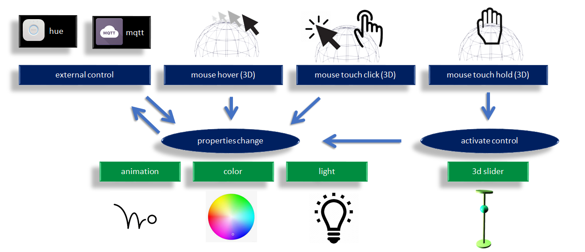
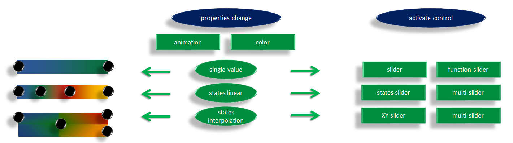

# Introduction
This repo contains webGL Three.js based interface demos for interactions with 3d data using mouse and touch.

# Real use case

This repository has boilerplates samples. A real use case example is a 3d home model. While the focus of this repo is the 3d interactions only, this repo is used in another project linked below where it is connected to real devices and network libraries.

https://github.com/HomeSmartMesh/smart_home_3d_webapp


Now back to the description of this repository content :

# Concept




## 3d objects properties
Manipulation of properties such as mesh animation and color. This control can operate from an external interface of through internal 3d mouse events.

call to modify a property:
```javascript
send_custom_event("three_color",{name:"Kitchen", val:0.3});
```

## 3d mouse events
Events such as hover, click and long press. These events uses rays to match the 3d objects meshes.

user handling of 3d mouse events:
```javascript
window.addEventListener( 'mesh_touch_start', onMeshTouch, false );

function onMeshMouseDown(e){
    console.log(`Mesh Touch on ${e.detail.name}`);
}
```

## 3d slider control
On activation of the control, new objects such as a slider pop up in the scene and takes over the mouse control. While the user is acting on the control, the control is producing events. The whole cycle can be as short as the user touching the 3d element, the slider popup with the bullet already under the user's finger, the user shifts slightly to the new desired position and on touch release the slider goes away.

```javascript
window.addEventListener( 'mesh_control', onMeshControl, false );

function onMeshControl(e){
    console.log(`update of ${e.detail.name} value to ${e.detail.val}`);
}
```

# 01 mouse hover on mesh


[Live demo](https://homesmartmesh.github.io/web_three_interface/01_mesh_mouse_on_hover/)

[01 mouse hover on mesh - github directory](./01_mesh_mouse_on_hover)


The user moves the mouse over the sphere object which changes color on enter and on exit events.

## Design


This mouse hover example is easily reusable as it is split in modules. The "three_mouse.js" contains the conversion logic from the web mouse events to the 3D mouse mesh events. It is isolated from the main application logic in "main.js", and both isolated from the "three_app.js" which contains clasical three environment and shapes creation.
* On init : The user is only supposed to know the names of the created obejcts in the the three scene, and passes a list of names to get back a list of meshes with `three.getObjects()`.
  
  This list is then provided to the "three_mouse.js" module.
* On event, the "three_mouse.js" triggers events on mouse entering the mesh and exit from the mesh. These events provide the name of the mesh. The name can be used to call a "three_app.js" function that sets the state according to the event, in this demo the emissive color is changing.

# 02 mouse down and touch


[Live demo](https://homesmartmesh.github.io/web_three_interface/02_mouse_down_and_touch/)

[02 mouse down and touch - github directory](./02_mouse_down_and_touch)


The design and the on-hover effect from demo 01 are kept. Added is a "mouse down" and "touch start" events. These new events act on the specular effect of the material to give a green shininess.

Note that on the gif, the mouse down event is shown with a yellow spot added by the gif recorder. When the user touches the screen and start moving the scene, the mouse disappears and the touch is visible through the touch gray spot.

# 03 mouse on glTF imports


[Live demo](https://homesmartmesh.github.io/web_three_interface/03_mouse_on_glTF_imports/)

[03 mouse on glTF imports - github directory](./03_mouse_on_glTF_imports)

## Workflow


Once familiar with THREE.js concepts, and there is the need to render a more complex scene, it becomes quickly complex to configure every parameter in the code. Looping between editing parameters and display require a reload. That's where professional 3d editing tools coming handy. Thanks to the [glTF](https://en.wikipedia.org/wiki/GlTF) (OpenGL Transmission Format), exporting a scene from [Blender](https://en.wikipedia.org/wiki/Blender_(software)) to THREE.js becomes easy. Not only 3d objects with beshes are exported but also cameras and lights. Note that export include options on blender are required.

Below is a screenshot from the blender Data outliner.


### current limitations
* The imported camera does not inherit the aspect ratio from the viewer and has to be adjusted, so reworked anyway.
* The lights do not have the shadow camera fully configured, and the mapSize set to default, so there is still a need for customisation.

The user here hovers and clicks on the sphere. Default materials have been used in this example to keep it as close to the previous examples as possible.

# 04 real rooms model


[Live demo](https://homesmartmesh.github.io/web_three_interface/04_real_rooms_model/)

[04 real rooms model - github directory](./04_real_rooms_model)

## Parametric modelling


For technical and architectural designs, parametric modelling can come in quite handy. [Fusion360](https://www.autodesk.com/products/fusion-360/overview) is a reference tool when it comes to that. The usage of geometrical sketches reduces the complexity of rooms modelling by simply entering the dimensions.

## Workflow

The workflow is extended as shown below.


## File Format
".fbx" is the only common format between both tools that keeps the scale and the hirerchy of objects. The ".stl" and ".obj" pack the whole model in a single mesh.

<table>
<tr>
<th width="40%"> Fusion 360 exports format </th>
<th width="30%"> Blender Import Formats </th>
</tr>

<tr>
<td width="40%">  </td>
<td width="30%">  </td>
</tr>
</table>

# 05 interactive lights


[Live demo](https://homesmartmesh.github.io/web_three_interface/05_interactive_lights/)

[05 interactive lights - github directory](./05_interactive_lights)

## Mesh to Light connection
Custom properties are input from blender and can be transferred within the glTF file by checking their export option. Here they've been used to reference which mesh event are going to act on which light to switch it on and off.


# 06 light groups


[Live demo](https://homesmartmesh.github.io/web_three_interface/06_light_groups/)

[06 light groups - github directory](./06_light_groups)

## Mesh to light with Parenting


A new concept different from the previous example 05, is to simplify the mesh used to activate the light, and the light obejct connected without custom properties, rather with the light being a child object of the mesh within the blender model and as imported in the three.js scene.

As the mouse interaction is not specific to lights but could be applied to any sort of mesh, it is now explicitely set as custom property "mouseEvent"

## Light grouping


Multiple lights having a similar blender structure as in the previous paragraph, can be gruoped under a common parent (in this figure above 5 of them). The parent should have as custom property "lightgroup" and also "mouseEvent" in order to receive a mouse interaction. The three_app provide functions to manage the light group by forwarding Set functions to the children lights. 

Note the logic of group light click is defined to switch off all lights if any of the children is on.


# 07 interactive heating


[Live demo](https://homesmartmesh.github.io/web_three_interface/07_interactive_heating/)

[07 interactive heating - github directory](./07_interactive_heating)

Added features in this demo:
* Shadows
* Complete Home lighting setup
* Heating as separate interactive type

The heating has the custom parameter `type=Heating`. It also features an mqtt topic for future extensions. Its separate type allow handling it through a different module than the lighting.

## Issues and limitations

### glTF blender to three.js limitation

hit a bug when exporting a rotated child of a scaled mesh, the child mesh gets a weired distorded shaped in comparision to blender visualisation.

### webGL shadows limitations

It was not possible to enable casting shadows with all lights that exceed a number of 16, so the spots got their castShadow set to false. 

    three.min.js:82 THREE.WebGLProgram: shader error:  0 35715 false gl.getProgramInfoLog FRAGMENT shader texture image units count exceeds MAX_TEXTURE_IMAGE_UNITS(16)

### self shadows on flat surface

When enabling both casting shadows and receiving shadows on the same flat surface, the below aliasing appears. So shadows were restricted to casting from walls and receiving by floors.


# 08 parameter to animation


[Live demo](https://homesmartmesh.github.io/web_three_interface/08_parameter_to_animation/)

[08 parameter to animation - github directory](./08_parameter_to_animation)

We see above the user moving the gui.dat parameter which is rotating the object. Although rotating an object in three.js is quite simple, this demo shows how to do this through an animation. That gives the advantage of abstracting the animation design from the parameter that will be controlling the animation.

## blender side
Due to a three.js limitation (apparently), it was not possible to identify which object has which animation although it is available in the glTF and known by the internal three.js objects somehow. This was overcome by using a custom parameter on the object that mention the animation name:


## animation hint
For controlled animation type, the animation is expected to be linear otherwise any distorsion will impact the parameter mapping as well :


## design param to animation


# 09 Rotation Scale State parameters


[Live demo](https://homesmartmesh.github.io/web_three_interface/09_param_rot_scale_view/)

[09 Rotation Scale State parameters - github directory](./09_param_rot_scale_view)

In this demo above we see the user acting on the dat.gui elements to modify the rotation of the first item through the "pull" parameter, the scale of a rectangle within the second item through the "heat parameter" and updating the state of the third item through the drop down "view" menu

## Animating colors
We will be talking about "parameters" in stead of animations as it is unfortunately not possible to map all required parameters modifications to animations. One of the main goals of this project is to animate color and that is simply not yet supported by the .glTF standard. Therefore, in a first step, a multiple states concept is introduced where each state can be selected by its name, and each state is a completely different child mesh that can have a different geometry and material. Note that modifying geometry only is not required here as it could be done through animation, but there's no other way to assign more than one material to one mesh.

### glTF limitations : No support for material animations
* https://github.com/KhronosGroup/glTF-Blender-Exporter/issues/335
* https://github.com/KhronosGroup/glTF/pull/1301#issuecomment-422932982

## blender structure of the selectable state as parameter


## Usage
To select one state, it is enough to send a javascript custom event with the name of the object to be updated and as value, the child state to be assigned :

```javascript
    send_custom_event("three_param",{name:"Cameleon", val:"plate1"});
```

# 10 More States and material color animation


[Live demo](https://homesmartmesh.github.io/web_three_interface/10_parameter_to_color/)

[10 More States and material color animation - github directory](./10_parameter_to_color)

In this demo, the previous example is extended with another state. Any number of states can actually be set. A method for color variation is also acheived. This change only concerns the material RGB color, not the speculiar or others. Here a parameter is interpolating two colors, but it is possible even to have any number of colors, where each will have an interpolation weight.

## Blender structure of the animated color object


## Usage

```javascript
    send_custom_event("three_param",{name:"Cameleon", appear1:0.3, appear2:0.7});
```

in order to have a coherent result, the sum of the given parameters is expected to be equal to one.

# 11 controls


[Live demo](https://homesmartmesh.github.io/web_three_interface/11_controls/)

[11 Controls 3d slider - github directory](./11_controls)

In this demo, we see the user seamlessly alternating between the usage of a classical slider from the dat.gui and the new 3d slider control. The color ratio stays consistent when updating it by either method.

## usage

Updating the color is as simple as sending an event with just the object name and ratio between 0 and 1.

```javascript
    send_custom_event("three_color",{name:"Kitchen", val:0.3});
```

Using the 3d slide events are as simple as subscribing to the mesh control event

```javascript
	window.addEventListener( 'mesh_control', onMeshControl, false );
```
then using it on the callback
```javascript
function onMeshControl(e){
    items_anim[e.detail.name] = e.detail.val;
}
```
## config in blender
This color vatiation concept has been simplified and labeled as "mutateColor", where no extra blender dummy material is required and a simple hex color field, which can be copied from the blender color picker.


# 12 multiple parameters


[Live demo](https://homesmartmesh.github.io/web_three_interface/12_multiple_parameters/)

[12 multiple parameters - github directory](./12_multiple_parameters)

In this demo, the user is interacting with the light bulb in two ways, clicks for quick actions full switch on or off for all parameters, or with the hold (>600 ms) to smoothly adjust the value with the 3d slider.

## Usage
```javascript
	window.addEventListener( 'mesh_control', onMeshControl, false );
	window.addEventListener( 'mesh_click', onMeshClick, false );
	window.addEventListener( 'mesh_hold', onMeshHold, false );

    send_custom_event("three_param",{name:"Kitchen", emissive:items_anim.Emissive});
    send_custom_event("three_param",{name:"Kitchen", light:items_anim.Light});
    send_custom_event("three_param",{name:"Kitchen", color:items_anim.Color});
``` 

# advanced control



in this diagram we see the options to control a single value linearly.
It is planned to expand the functionalities to multi linear states and states interpolation

# Module Dependencies

* [jsm/dat.gui.module.js](https://raw.githubusercontent.com/dataarts/dat.gui/v0.7.6/build/dat.gui.module.js)

* [jsm/three/three.module.js](https://raw.githubusercontent.com/mrdoob/three.js/r111/build/three.module.js)
* [jsm/three/OrbitControls.js](https://raw.githubusercontent.com/mrdoob/three.js/r111/examples/jsm/controls/OrbitControls.js)
* [jsm/three/GLTFLoader.js](https://github.com/mrdoob/three.js/blob/r111/examples/jsm/loaders/GLTFLoader.js)

# Features
* mouse and touch for mesh hover and down
* click event and hold event (configurable click speed)
* 3d slider size adjusted on controlled object's size

## features plan
scene
* load camera from gltf
* adjust camera to scene scale (clip and distance)
* bake shadow textures with blender according to sunlight position

control
 * display slider direction facing the camera
 * multi touch control, using multiple slider instances

doc
 * show control object slider placement relative to camera

code
 * refactor modules in separate npm repo (three_mouse, three_controls, three_app not the home_app)
 * add cache-manifest

```javascript
send_custom_event("three_param",{name:"Kitchen", color:0.3});
send_custom_event("three_param",{name:"Kitchen", light:0.3});
send_custom_event("three_param",{name:"Kitchen", anim:0.3});
send_custom_event("three_param",{name:"Kitchen", pull:0.3});
send_custom_event("three_param",{name:"Kitchen", push:0.3});
```
