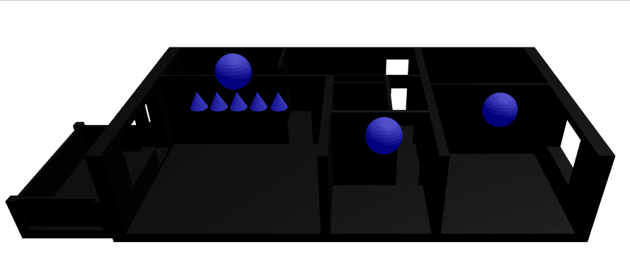

# Introduction
This repo contains webGL Three.js based interface demos for interactions with 3d data using mouse and touch. This readme does not go through the different samples in the numeric order as the most interesting have been presented first.

# Interaction with real lights

This repository is intended as boiler plate to showcase the interactions with a 3d home model. For abstraction purpose, it does not include any connection to real devices or network libraries. Such usage is developed within this project below that has the same development model and license:

https://github.com/HomeSmartMesh/smart_home_3d_webapp

# 07 interactive heating

[Live demo](https://homesmartmesh.github.io/web_three_interface/07_interactive_heating/)

[07 interactive heating - github directory](./07_interactive_heating)

## Features
Added features in this demo:
* Shadows
* Complete Home lighting setup
* Heating as separate interactive type

The heating has the custom parameter `type=Heating`. It also features an mqtt topic for future extensions. Its separate type allow handling it through a different module than the lighting.

## Issues and limitations

### glTF blender to three.js limitation

hit a bug when exporting a rotated child of a scaled mesh, the child mesh gets a weired distorded shaped in comparision to blender visualisation.

### webGL shadows limitations

It was not possible to enable casting shadows with all lights that exceed a number of 16, so the spots got their castShadow set to false. 

    three.min.js:82 THREE.WebGLProgram: shader error:  0 35715 false gl.getProgramInfoLog FRAGMENT shader texture image units count exceeds MAX_TEXTURE_IMAGE_UNITS(16)

### self shadows on flat surface

When enabling both casting shadows and receiving shadows on the same flat surface, the below aliasing appears. So shadows were restricted to casting from walls and receiving by floors.

# 06 light groups

[Live demo](https://homesmartmesh.github.io/web_three_interface/06_light_groups/)

[06 light groups - github directory](./06_light_groups)

## Mesh to light with Parenting

A new concept different from the previous example 05, is to simplify the mesh used to activate the light, and the light obejct connected without custom properties, rather with the light being a child object of the mesh within the blender model and as imported in the three.js scene.

As the mouse interaction is not specific to lights but could be applied to any sort of mesh, it is now explicitely set as custom property "mouseEvent"

## Light grouping

Multiple lights having a similar blender structure as in the previous paragraph, can be gruoped under a common parent (in this figure above 5 of them). The parent should have as custom property "lightgroup" and also "mouseEvent" in order to receive a mouse interaction. The three_app provide functions to manage the light group by forwarding Set functions to the children lights. 

Note the logic of group light click is defined to switch off all lights if any of the children is on.

# 05 interactive lights

[Live demo](https://homesmartmesh.github.io/web_three_interface/05_interactive_lights/)

[05 interactive lights - github directory](./05_interactive_lights)

## Mesh to Light connection
Custom properties are input from blender and can be transferred within the glTF file by checking their export option. Here they've been used to reference which mesh event are going to act on which light to switch it on and off.

# 04 real rooms model

[Live demo](https://homesmartmesh.github.io/web_three_interface/04_real_rooms_model/)

[01 mouse hover on mesh - github directory](./04_real_rooms_model)

## Parametric modelling

For technical and architectural designs, parametric modelling can come in quite handy. [Fusion360](https://www.autodesk.com/products/fusion-360/overview) is a reference tool when it comes to that. The usage of geometrical sketches reduces the complexity of rooms modelling by simply entering the dimensions.

## Workflow

The workflow is extended as shown below.

## File Format
".fbx" is the only common format between both tools that keeps the scale and the hirerchy of objects. The ".stl" and ".obj" pack the whole model in a single mesh.

<table>
<tr>
<th width="40%"> Fusion 360 exports format </th>
<th width="30%"> Blender Import Formats </th>
</tr>

<tr>
<td width="40%">  </td>
<td width="30%">  </td>
</tr>
</table>

# 03 mouse on glTF imports

[Live demo](https://homesmartmesh.github.io/web_three_interface/03_mouse_on_glTF_imports/)

[03 mouse on glTF imports - github directory](./03_mouse_on_glTF_imports)

## Workflow

Once familiar with THREE.js concepts, and there is the need to render a more complex scene, it becomes quickly complex to configure every parameter in the code. Looping between editing parameters and display require a reload. That's where professional 3d editing tools coming handy. Thanks to the [glTF](https://en.wikipedia.org/wiki/GlTF) (OpenGL Transmission Format), exporting a scene from [Blender](https://en.wikipedia.org/wiki/Blender_(software)) to THREE.js becomes easy. Not only 3d objects with beshes are exported but also cameras and lights. Note that export include options on blender are required.

Below is a screenshot from the blender Data outliner.

### current limitations
* The imported camera does not inherit the aspect ratio from the viewer and has to be adjusted, so reworked anyway.
* The lights do not have the shadow camera fully configured, and the mapSize set to default, so there is still a need for customisation.

The user here hovers and clicks on the sphere. Default materials have been used in this example to keep it as close to the previous examples as possible.

# 02 mouse down and touch

[Live demo](https://homesmartmesh.github.io/web_three_interface/02_mouse_down_and_touch/)

[02 mouse down and touch - github directory](./02_mouse_down_and_touch)

The design and the on-hover effect from demo 01 are kept. Added is a "mouse down" and "touch start" events. These new events act on the specular effect of the material to give a green shininess.

Note that on the gif, the mouse down event is shown with a yellow spot added by the gif recorder. When the user touches the screen and start moving the scene, the mouse disappears and the touch is visible through the touch gray spot.

# 01 mouse hover on mesh

[Live demo](https://homesmartmesh.github.io/web_three_interface/01_mesh_mouse_on_hover/)

[01 mouse hover on mesh - github directory](./01_mesh_mouse_on_hover)

The user moves the mouse over the sphere object which changes color on enter and on exit events.

## Design

This mouse hover example is easily reusable as it is split in modules. The "three_mouse.js" contains the conversion logic from the web mouse events to the 3D mouse mesh events. It is isolated from the main application logic in "main.js", and both isolated from the "three_app.js" which contains clasical three environment and shapes creation.
* On init : The user is only supposed to know the names of the created obejcts in the the three scene, and passes a list of names to get back a list of meshes with `three.getObjects()`.
  
  This list is then provided to the "three_mouse.js" module.
* On event, the "three_mouse.js" triggers events on mouse entering the mesh and exit from the mesh. These events provide the name of the mesh. The name can be used to call a "three_app.js" function that sets the state according to the event, in this demo the emissive color is changing.

